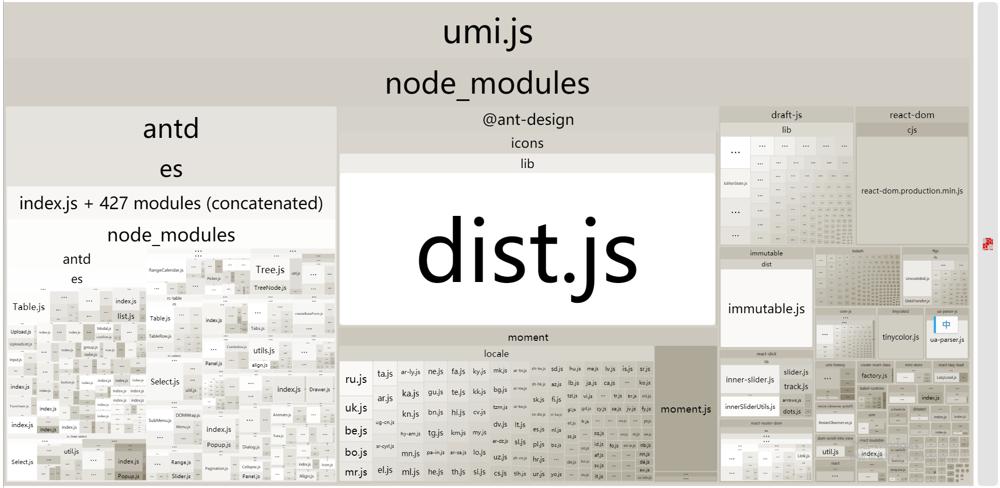
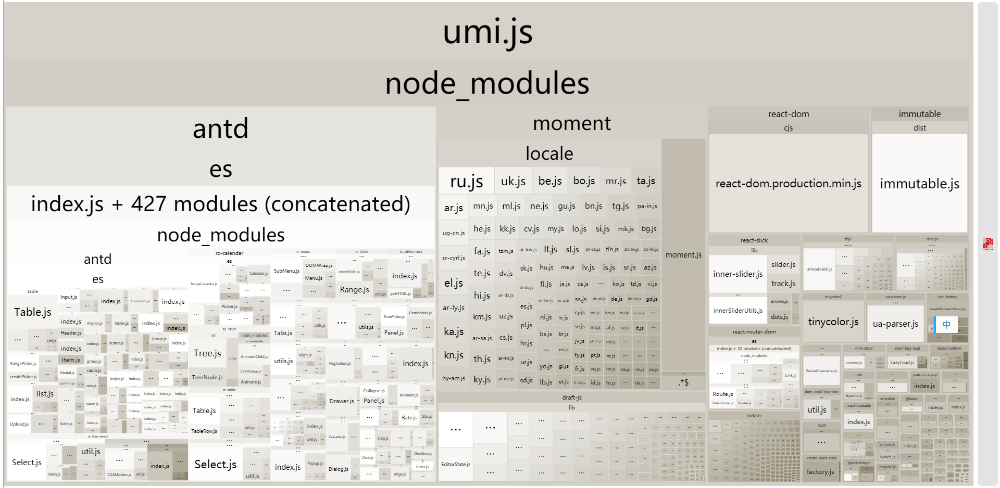
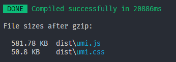
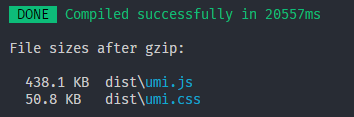

# Reduce Antd icons bundle size

See [related issue](https://github.com/ant-design/ant-design/issues/12011#issuecomment-420038579).

| Before | After |
|:----:|:----:|
| | |
| | |

## Config `alias`

See the whole file [src/icons.js](./src/icons.js)
```js
// src/icons.js

// export what you need
export {
  default as SmileOutline
} from '@ant-design/icons/lib/outline/SmileOutline';
export {
  default as MehOutline
} from '@ant-design/icons/lib/outline/MehOutline';

// export what antd other components need
export {
  default as CloseOutline
} from '@ant-design/icons/lib/outline/CloseOutline';
// and other icons...
```

```js
// .umirc.js
export default {
  alias: {
    '@ant-design/icons/lib/dist$': path.resolve(__dirname, './src/icons.js')
  }
};
```

```
// vue.config.js
module.exports = {
  configureWebpack: {
    resolve: {
      alias: {
        "@ant-design/icons/lib/dist$": path.resolve(__dirname, "./src/icons.js")
      }
    }
  }
};
```
